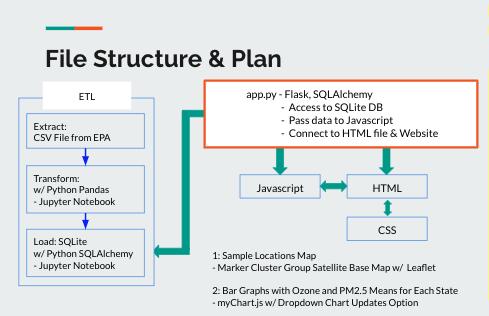
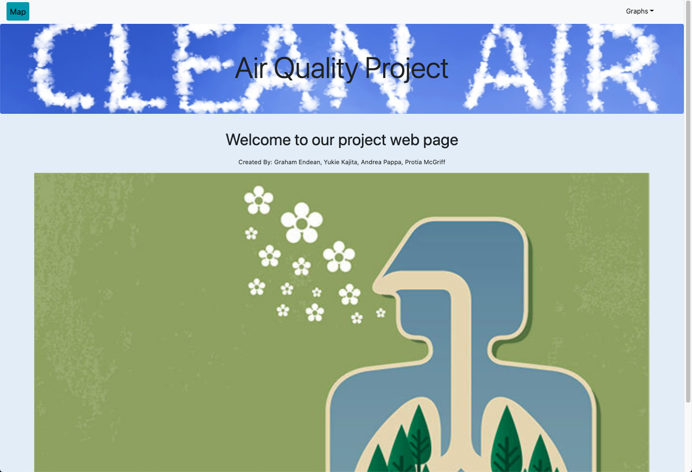
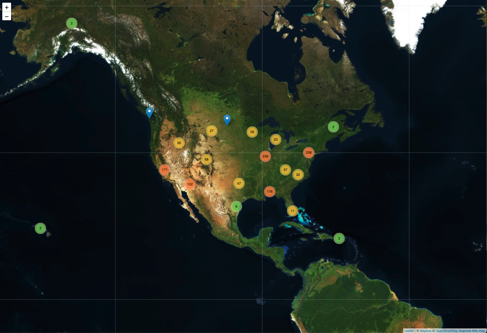
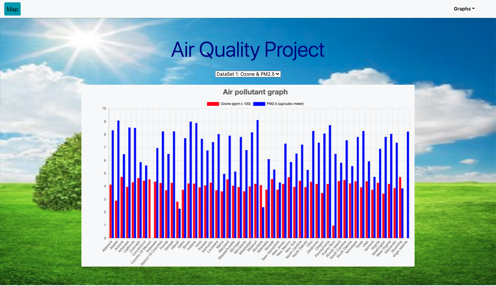

# Air Quality Data Project

Air Quality Audit
Welcome to our Air Quality github page. The purpose of this repository is to house 
information related to air quality data and research. The goal is to leverage EPA data to
understand where the best air-quality can be found in the United States.  

Meet the team
Graham Endean | Yukie Kajita | Portia McGriff | Andrea Pappa 

Background
Air quality is more important today than ever before. 
The quality can be referenced as an indicator of our environmental health. 
It may also be correlated to individual health outcomes in certain geographic regions. 
We are analyzing this information as an academic endeavor focused on the use of Python, JavaScript, D3, and Leaflet for analytics and modeling.
In this scenario, our deliverable will be meaningful visual outputs integrating end-user interactive functionality.  

Process Flow Chart 

Process
1. We extracted the CSV data file from EPA.gov (https://www.epa.gov/outdoor-air-quality-data/air-data-daily-air-quality-tracker)
2. We loaded the CSV file into Python with Jupyter Notebook to clean the data and narrow the columns to be evaluated.  
3. The cleanded data frames were imported into SQLite. 
4. App.py Flask was leveraged to connect the backend data to our front-end display. 
5. SQLite DB was then accessed through flask, and the data were passed to JavaScript.
6. The data were jsonified. 
7. CSS, HTML, Javascript, D3, myChart.js, and Leaflet were used to create dashboard, charts, and map, and interactive functionality. 

Our Main Webpage Image

Map Page Image

Graph Page Image

Enjoy!

